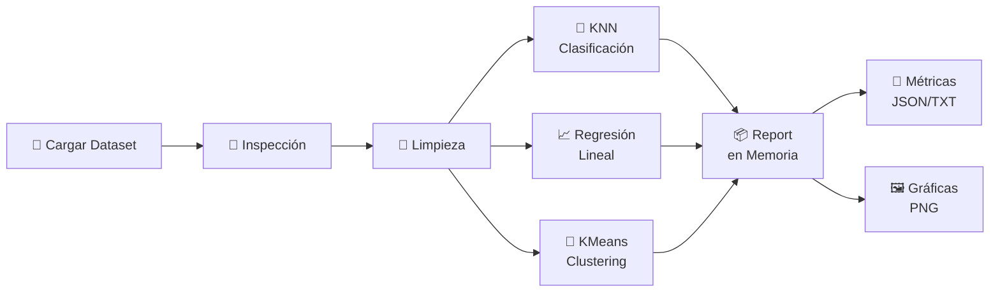

<div align="center">

# 🔭 SDSS ML Pipeline


<br/>

> **Pipeline de Machine Learning modular y reproducible** sobre datos astronómicos del **Sloan Digital Sky Survey (SDSS)** — contenerizado con Docker y automatizado con Jenkins.

</div>

---

## 📋 Tabla de Contenidos

- [✨ Características](#-características)
- [🚀 Estado del Proyecto](#-estado-del-proyecto)
- [🗂️ Estructura del Proyecto](#️-estructura-del-proyecto)
- [🌌 Dataset](#-dataset)
- [⚙️ Flujo del Pipeline](#️-flujo-del-pipeline)
- [🧩 Módulos](#-módulos)
- [📊 Outputs Generados](#-outputs-generados)
- [🏃 Cómo Ejecutarlo](#-cómo-ejecutarlo)
- [🐳 Docker](#-docker)
- [🤖 Jenkins CI/CD](#-jenkins-cicd)
- [🏛️ Decisiones de Diseño](#️-decisiones-de-diseño)

---

## ✨ Características

| Característica | Detalle |
|---|---|
| 🔍 **Clasificación** | K-Nearest Neighbors (`k=5`) con métricas accuracy + confusion matrix |
| 📈 **Regresión** | Regresión Lineal sobre `redshift` con MSE y R² |
| 🔵 **Clustering** | KMeans (`k=3`) con Silhouette Score y proyección PCA |
| 🐳 **Docker** | Pipeline completamente contenerizado y reproducible |
| 🤖 **Jenkins** | CI/CD automático con validación de artefactos |
| 📦 **Reportes** | Métricas en JSON + TXT y gráficas en PNG |

---

## 🚀 Estado del Proyecto

```
✅ Fase 1 — Estructura base, carga del dataset, inspección y preprocesamiento
✅ Fase 2 — Clasificación con KNN (k=5)
✅ Fase 3 — Regresión Lineal
✅ Fase 4 — Clustering con KMeans (k=3)
✅ Fase 5 — Guardado de métricas y gráficas en outputs/
✅ Fase 6 — Integración end-to-end en main.py
✅ Fase 7 — Dockerización del proyecto
✅ Fase 8 — Pipeline básico con Jenkins
🔄 Pendiente — Ajustes finales según entorno de despliegue
```

---

## 🗂️ Estructura del Proyecto

```text
sdss-ml-docker-jenkins/
├── 📄 main.py                  # Orquestador principal del pipeline
├── 📄 README.md
├── 📄 requirements.txt
├── 🐳 Dockerfile
├── 📄 .dockerignore
├── 🤖 Jenkinsfile
├── 📊 sdss_sample.csv          # Dataset astronómico SDSS
├── outputs/
│   ├── metrics/                # Métricas en JSON y TXT
│   └── plots/                  # Gráficas en PNG
└── src/
    ├── __init__.py
    ├── preprocessing.py        # Carga y limpieza de datos
    ├── classification.py       # KNN
    ├── regression.py           # Regresión Lineal
    ├── clustering.py           # KMeans + PCA
    └── reporting.py            # Persistencia de resultados
```

---

## 🌌 Dataset

El dataset `sdss_sample.csv` contiene observaciones astronómicas del **Sloan Digital Sky Survey**.

| Columna | Descripción |
|---|---|
| `u`, `g`, `r`, `i`, `z` | Magnitudes fotométricas en distintas bandas |
| `redshift` | Corrimiento al rojo (objetivo de regresión) |
| `class` | Clase astronómica real: `Galaxy`, `Star`, `QSO` |
| `snr_r` | Relación señal/ruido en banda `r` |
| `extinction_r` | Extinción en banda `r` |

---

## ⚙️ Flujo del Pipeline



> **Regla clave:** los modelos **no escriben archivos directamente**. Cada módulo retorna resultados al `report` en memoria, y `reporting.py` es el único que persiste en disco.

---

## 🧩 Módulos

<details>
<summary><b>🧹 src/preprocessing.py</b></summary>

- `load_data()` — Carga el CSV con pandas
- `inspect_data()` — Revisión de tamaño, tipos, nulos y duplicados
- `clean_data()` — Conversión de columnas numéricas y validación de columnas obligatorias

</details>

<details>
<summary><b>🤖 src/classification.py</b></summary>

- **Modelo:** `KNeighborsClassifier` con `k=5`
- **Escalado:** `StandardScaler`
- **Métricas:** `accuracy`, `confusion_matrix`

</details>

<details>
<summary><b>📈 src/regression.py</b></summary>

- **Modelo:** `LinearRegression` (baseline)
- **Escalado:** `StandardScaler`
- **Objetivo:** `redshift`
- **Métricas:** `MSE`, `R²`
- **Nota:** puede generar predicciones negativas al no restringir la salida

</details>

<details>
<summary><b>🔵 src/clustering.py</b></summary>

- **Modelo:** `KMeans` con `k=3`
- **Escalado:** `StandardScaler`
- **Evaluación:** `silhouette_score`, tamaño de clusters
- **Visual:** proyección 2D con PCA y comparación `cluster_vs_class`

</details>

<details>
<summary><b>📦 src/reporting.py</b></summary>

- Guarda reportes en **JSON** y **TXT**
- Genera gráficas en **PNG**
- Separa métricas compactas de datos auxiliares para visualización

</details>

---

## 📊 Outputs Generados

### `outputs/metrics/`

| Archivo | Contenido |
|---|---|
| `pipeline_report.json` | Reporte consolidado del pipeline |
| `summary.txt` | Resumen corto de resultados |
| `classification_metrics.json` | Accuracy y confusion matrix |
| `regression_metrics.json` | MSE y R² |
| `regression_plot_data.json` | Datos para la gráfica de regresión |
| `clustering_metrics.json` | Silhouette score y tamaños |
| `clustering_plot_data.json` | Datos para gráficas de clustering |

### `outputs/plots/`

| Archivo | Descripción |
|---|---|
| `classification_confusion_matrix.png` | Matriz de confusión KNN |
| `regression_actual_vs_predicted.png` | Actual vs Predicho |
| `clustering_projection.png` | Proyección PCA de clusters |
| `clustering_vs_class.png` | Clusters vs clases reales |

---

## 🏃 Cómo Ejecutarlo

### Instalación local

```bash
python -m venv .venv
source .venv/bin/activate        # Linux / macOS
# o en Windows PowerShell:
# .\.venv\Scripts\Activate.ps1

pip install --upgrade pip
pip install -r requirements.txt
python main.py
```

### Ejecución parcial (saltar etapas)

```bash
python main.py --skip-classification
python main.py --skip-regression
python main.py --skip-clustering
```

### Verificar resultados

Después de ejecutar el pipeline deberías encontrar:

```
outputs/
├── metrics/
│   ├── pipeline_report.json   ✅
│   ├── summary.txt            ✅
│   ├── classification_metrics.json
│   ├── regression_metrics.json
│   └── clustering_metrics.json
└── plots/
    ├── classification_confusion_matrix.png  ✅
    ├── regression_actual_vs_predicted.png   ✅
    ├── clustering_projection.png            ✅
    └── clustering_vs_class.png
```

---

## 🐳 Docker

### Construir la imagen

```bash
docker build -t sdss-ml-pipeline .
```

### Ejecutar el pipeline

```bash
docker run --rm sdss-ml-pipeline
```

### Recuperar outputs en tu máquina

```bash
# Linux / macOS
docker run --rm -v "$(pwd)/outputs:/app/outputs" sdss-ml-pipeline

# Windows PowerShell
docker run --rm -v "${PWD}/outputs:/app/outputs" sdss-ml-pipeline
```

> Esto monta la carpeta `outputs/` local dentro del contenedor, permitiéndote acceder a métricas y gráficas generadas sin entrar al contenedor.

---

## 🤖 Jenkins CI/CD

El `Jenkinsfile` define un pipeline automatizado con las siguientes etapas:

```
┌──────────────────────────────────────────────────────────────┐
│  Jenkins Pipeline                                            │
│                                                              │
│  1. Checkout        → Descarga el código del repo           │
│  2. Build Image     → docker build -t sdss-ml-pipeline .    │
│  3. Run Pipeline    → docker run con outputs montado        │
│  4. Validate        → Verifica que los archivos existan     │
│  5. Archive         → Guarda artefactos en Jenkins          │
└──────────────────────────────────────────────────────────────┘
```

> **Requisito:** el agente de Jenkins debe tener **Docker disponible**.

Cuando Jenkins ejecuta un build:
1. Lee el `Jenkinsfile`
2. Ejecuta cada etapa en orden
3. Si una etapa falla, detiene el pipeline
4. Si todo sale bien, los artefactos quedan accesibles desde la interfaz de Jenkins

---

## 🏛️ Decisiones de Diseño

| Decisión | Razón |
|---|---|
| `main.py` como orquestador | Punto de entrada único y claro |
| Módulos independientes | Facilita mantenimiento, pruebas y extensión |
| Resultados en memoria | Desacopla lógica de ML del sistema de archivos |
| Reporting centralizado | Un único responsable de persistencia en disco |
| Métricas y datos de visualización separados | Permite consultar métricas sin cargar datos pesados |

---

<div align="center">

**⭐ Si este proyecto te fue útil, dale una estrella al repositorio ⭐**


</div>
